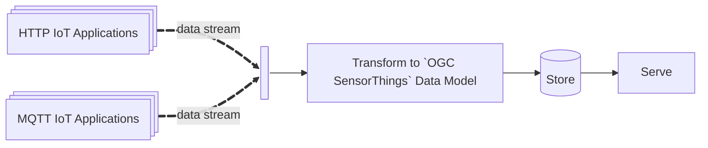
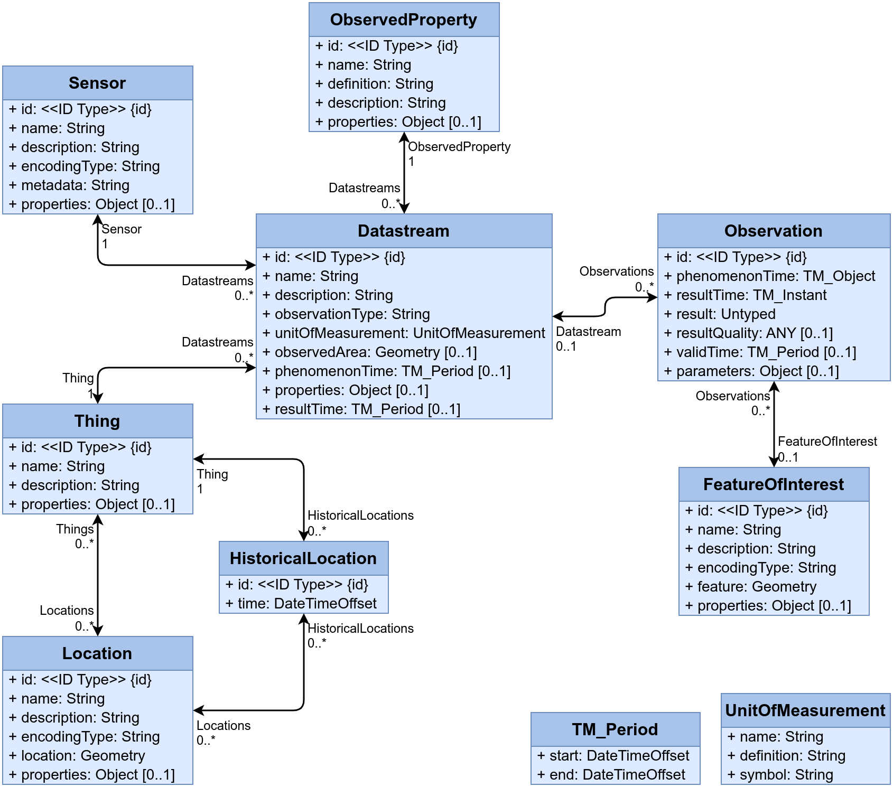

# st-utils

## What is it?

**st-utils** (SensorThings Utilities) is an **Extract, Transform and Load**
Internet of Things (IoT) application with data interoperability as its founding
principle.

The application allows for observations from *hetereogeneous* sensor networks
into one normalized stream and structure which conforms with the [OGC
SensorThings](https://www.ogc.org/publications/standard/sensorthings/) standards
and data model: 



`st-utils` is built on Franhofer's [FROST
Server](https://github.com/FraunhoferIOSB/FROST-Server) and adds a
transformation and management layer.

## System Requirements

The system requirements are fairly minimal:

- `Docker` and `Docker Compose`
- `git`
- `Python >=3.9`
- Internet access

## Deployment Requirements

Deployment requires and assumes the following:

### Upstream Data Sources

You must have authenticated access to one or more Upstream Data Sources.
st-utils supports ingestion from:

- RESTful APIs: Sources providing observations via HTTP GET/POST (e.g.,
  proprietary vendor clouds)

- MQTT Brokers: Sources publishing to topics (e.g., The Things Network). 

### Sensor Specifications and Architecture

The application assumes you have enough information about the sensor *and what
it is observing* to be able to specify enough information to populate the
SensorThings datamodel:



## Quick Setup

The overall setup involves:

1. Cloning the repository,
2. Setting up mandatory internal credentials, 
3. Setting up external IoT applications and credentials,
4. Launching the system.

### Step 1: Clone the Repo and Create a Python Virtual Environment

```bash
git clone https://github.com/justinschembri/st-utils.git st-utils
cd st-utils
python3 -m venv .venv
source .venv/bin/activate
pip install -e .
# alternatively, if using uv: uv sync
```

### Step 2: Mandatory Internal Credentials

To quickly set up your instance of `st-utils`, use the inbuilt tooling:

```bash
$ stu setup
```

Upon the first launch of the CLI, you will be guided through setting up mandatory internal credentials. The system uses default usernames (`sta-admin`) which you can accept or override:

- **FROST**: Credentials for the FROST server (needed for data access and writing)
  - Default username: `sta-admin`
- **PostgreSQL**: Credentials for the backend PostgreSQL database
  - Default username: `sta-admin`
- **MQTT**: Internal Mosquitto users (at least one user is required)
  - Default username: `sta-admin` (for the first user)
- **Tomcat**: Web application authentication (optional)
  - Leave empty to allow public access (no authentication required)
  - Default username: `sta-admin` (if creating users)

All credentials are stored in the `deploy/secrets/credentials` directory.

### Step 3: Configure Applications

After setting up internal credentials, you'll see the main menu. To configure IoT applications:

**Option [1] Add application to config**: This will:
1. Guide you through adding a new application (HTTP or MQTT)
2. Configure connection settings and authentication type
3. **Automatically** prompt you to set up credentials/tokens for the application

IoT applications you have access to must be configured. Having 'access' to an IoT application means you have the required credentials or tokens to pull data from the IoT application. This present version of st-utils supports two application platforms: *Netatmo* and the popular *TheThingsStack*.

**Option [2] Manage existing credentials and tokens**: Use this to modify or update any credentials (internal or application-level) after initial setup.

**Option [3] Show configured applications**: View the status of all configured applications and their credential setup status.

### Step 4: Configure Sensor Configurations

Each physical sensor in your network requires a configuration file that describes the sensor, its location, the thing it monitors, and the datastreams it produces. These files must be placed in the `deploy/sensor_configs/` directory.

**Key Requirements:**

1. **One sensor per file**: Each configuration file describes exactly one sensor
2. **Filename convention**: The filename should match the sensor name (typically the device MAC address)
3. **File structure**: Each file must contain the following sections:
   - `sensors`: Physical sensor definition
   - `things`: The physical thing being monitored (building, room, component, etc.)
   - `locations`: Geographic location (must comply with GeoJSON)
   - `datastreams`: Data streams produced by the sensor (one per measurement type)
   - `observedProperties`: Properties being observed by the datastreams

**Template File:**

A template file is provided at `deploy/sensor_configs/template.yaml`. Use this as a starting point:

```bash
cp deploy/sensor_configs/template.yaml deploy/sensor_configs/<your-sensor-name>.yaml
```

Then edit the file following the instructions and `*fill` markers.

**Important Notes:**

- The sensor `name` field should typically match the device MAC address
- The sensor key (in the `sensors` section) can be in `<model>.<type>` format (e.g., `netatmo.nws03`, `milesight.am308l`)
- All `iot_links` references must use entity **names** (not keys)
- Use YAML anchors (`&`) and aliases (`*`) to avoid repetition (see template examples)
- The number of datastreams must match the list in the sensor's `iot_links.datastreams`
- Each datastream must link to exactly one sensor, one thing, and one observedProperty
- Location coordinates must follow GeoJSON format (longitude, latitude for Point type)

**Validation:**

You can validate your sensor configuration files using:

```bash
stu validate <path-to-config-file.yaml>
```

Or validate all configuration files in the current directory:

```bash
stu validate
```

**Example Structure:**

See the example configurations in:
- `deploy/sensor_configs/netatmo/` - Netatmo weather station examples
- `deploy/sensor_configs/milesight/` - Milesight sensor examples


# Supported Applications

st-utils supports integration with the following IoT application platforms:

- **Netatmo**: HTTP-based connection to Netatmo weather station APIs
  - Connection class: `NetatmoConnection`
  - Authentication: Token-based (OAuth2)
  - Protocol: HTTP/S (REST API)

- **TheThingsStack (TTS)**: MQTT-based connection to The Things Network
  - Connection class: `TTSConnection`
  - Authentication: API key-based
  - Protocol: MQTT

# Supported Sensor Models

The following sensor models are currently supported:

- **Milesight AM103L** (`milesight.am103l`): Indoor Air Quality Sensor
  - Measurements: Battery level, CO₂, Humidity, Temperature
  - Protocol: LoRaWAN (via TheThingsStack)
  - [Product Information](https://www.milesight.com/iot/am103l/)

- **Milesight AM308L** (`milesight.am308l`): Indoor Air Quality Sensor (7-in-1)
  - Measurements: Battery level, CO₂, Humidity, Temperature, Light level, Motion (PIR), Particulate Matter (PM2.5, PM10), Pressure, TVOC
  - Protocol: LoRaWAN (via TheThingsStack)
  - [Product Information](https://www.milesight.com/iot/am308l/)

- **Netatmo NWS03** (`netatmo.nws03`): Home Weather Station
  - Measurements: Temperature, CO₂, Humidity, Noise, Pressure
  - Protocol: Wi-Fi (via Netatmo API)
  - [Product Information](https://www.netatmo.com/en-eu/smart-weather-station)


